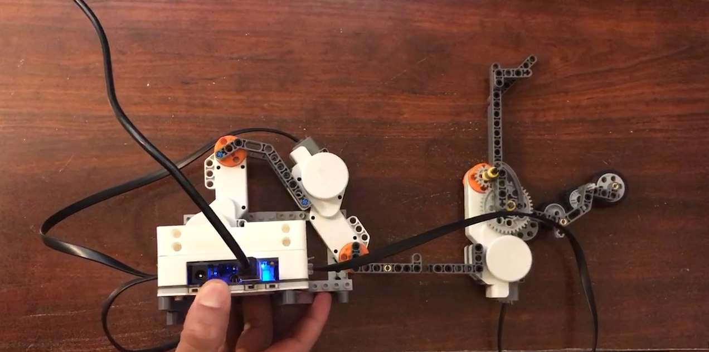
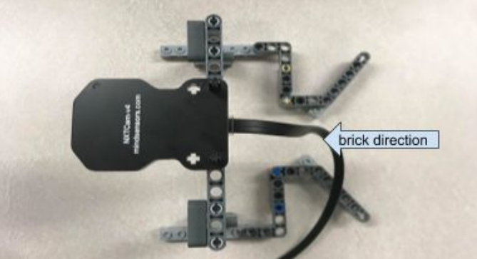

# RobotArm

## Parcitipating students:
* Benjamin Chu
* Jhomar Sumajit
* Sharfaraz Ahmed
___
# Abstract

The purpose of this project is to simulate a factory pick and place machine (robot with sensors) at an industrial plant.  The team is to design and build with a lego kit, select sensors and program the EV Shield to sort “Lego” bricks coming down a conveyor into the correct beer cup. 
___
# Pictures

Final arm prototype:

NXT Camera mount and rails:

## Full details in Report.pdf
